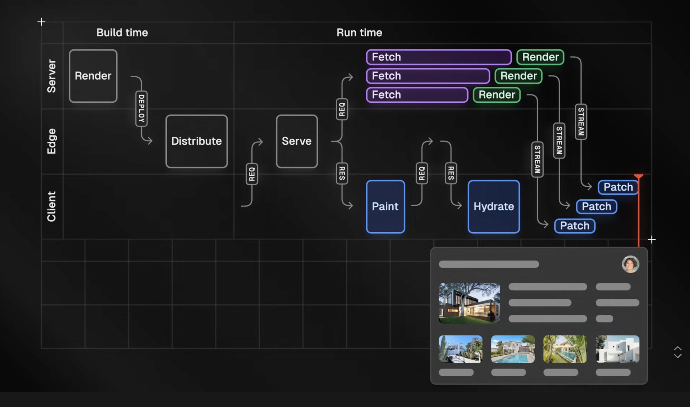

what is prerendering? Typically, when a server receives a request, it renders the page and sends the result back to the client. If a new request comes in, the server renders the page again. We call this end-of-the-spectrum dynamic rendering because the page is rendered on-demand for every incoming request. Pages that personalize content based on runtime information or frequently updated data require this per-request rendering because each render produces a different result. For example, an e-commerce site might show recommendations personalized to each user. However, most applications have some pages that do not benefit from dynamic rendering because they do not depend on any runtime information that would change the result of the render. For example, a company's blog might produce the same result every time it's rendered. We can optimize this subset of pages by doing the rendering work ahead of time. We call this end-of-the-spectrum prerendering or static rendering. Instead of dynamically rendering the page on every request at runtime, we can prerender the page once at build time and push the result to a Content Delivery Network. When a prerended page is requested, the static result is served from an Edge Region close to the user rather than a runtime server.

전통적으로 렌더링 방식에는 2가지(동적 렌더링과 정적 렌더링)가 존재한다. 
런타임 정보에 의존적이라면 동적 렌더링이 필요하지만, 대부분은 그렇지 않으므로 정적 렌더링이 효율적이다. 
정적 렌더링 방식은 빌드 타임에 렌더링을 한 뒤, 이 결과를 CDN에 전송하는 걸 말한다. 이후 필요하면 유저와 가까운 Edge Region에서 정적 결과물을 전달해줄 수 있으므로 빠르다.

History time! If we rewind a few years, it was common for web frameworks to specialize in either
Server-side rendering, Static Site Generation, Client-side rendering, or backend API endpoints.
This created an all-or-nothing decision where your whole application had to follow a single paradigm, even when it wasn’t optimal for some routes. As a fun anecdote, you’d often see a company's blog, dashboard, or API hosted on a subdomain. This was usually a sign a team had to spin up a completely new
project in a different framework or language just to have access to a different rendering strategy. As user expectations and industry trends evolved, developers started to experience friction with single paradigm frameworks. Dynamic heavy apps wanted to statically render some pages ahead of time. Static sites wanted to add some personalization. Server-first apps wanted to add some client-side interactivity and routing. Client-rendered apps wanted to improve the initial load performance and SEO of some pages or serve some backend API routes. Next.js grew in popularity partly because it offered more rendering diversity. Teams could use the same tool, in the same language, routing system,
and component model to handle the different use cases of all their routes without having to manage handoffs between different systems.

역사적으로 웹 프레임워크는 SSR, SSG, CSR 등 렌더링 방식을 명확히 구분 지어왔다. 하지만 웹이 성장함에 따라, 개발자는 단일 패러다임 프레임워크로 사용자의 요구사항들을 충족하기에는 어려움을 겪을 수밖에 없었다.

- 동적 사용량이 많은 앱 안에서도 일부 페이지는 정적으로 먼저 렌더링되기를 원했고, 반대로 정적 웹 사이트는 개인화를 충족하기 위해 동적인 렌더링이 일부 필요하기 시작했다.
- 인터랙션이 필요했던 CRA는 반대로 일부 페이지의 초기 로드 성능 및 SEO를 개선하거나 일부 백엔드 api route를 다룰 필요가 있었다.

Next.js가 지금까지 인기를 얻은 이유는 이렇듯 다양한 렌더링 방식 니즈를 충족시킬 수 있었기 때문이다. 정확히는, 다양한 렌더링 방식을 하나의 팀이 동일한 언어, 컴포넌트 모델, 도구 등을 유지하면서도 다양한 렌더링 방식을 선택할 수 있다는 장점에서였다.

So what does this all have to do with Partial Prerendering? Fast forward to today, and once again, we’re starting to reach the limit of single rendering paradigms. This time at the more granular page level. Even the most static pages, like a documentation page or blog post, sometimes need dynamic elements such as personalized code snippets, or a global navbar with the signed-in user. And, even the most dynamic pages share huge portions of static content between users. But you've probably already noticed the logical limitation with prerendering pages... We can’t prerender a page that depends on runtime information before receiving the request that contains that information. This leaves us with another all-or-nothing decision: either we statically prerender the page and lose the ability to personalize any of it, or we dynamically render the entire page on every request. This is where Partial Prerendering comes in. entire page on every request. This is where Partial Prerendering comes in. It allows us to combine the benefits and abilities of prerendering and dynamic rendering on the same page. Making pages as static or as dynamic as they need to be. So how does it work?

이런 역사적인 발전에서 아무리 다양한 렌더링 방식을 지원하더라도 단일 패러다임 프레임워크의 한계는 명확했다. 하나의 페이지 안에서도 정적 렌더링과 동적 렌더링이 쪼개질 필요가 있었고, 그게 PPR의 등장 이유이기도 하다.

As a reminder, Next.js currently prerenders a page at build time unless it uses dynamic APIs like incoming request headers or uncached data requests. These APIs signal the developers’ intention
and opt the whole page into dynamic rendering at runtime. This means using a single dynamic function opts all its parent components up to the root into dynamic rendering, even if those components don’t contain any other references to runtime information. What if we could somehow isolate this side effect and prevent it from spreading upwards? React has a concept of boundaries. Boundaries allow us to design a system that accounts for two opposing modes. For example, a page can be in a functioning or non-functioning state. We can wrap part of the page in a React Error Boundary and design fallback UI for the potential non-functioning state. If the wrapped UI ever enters this state, the error boundary will catch the error and render the user-friendly fallback. This prevents erroneous behavior inside an error boundary from breaking the rest of the page. Similarly, we can wrap components that include asynchronous operations in a React Suspense Boundary and design fallback UI for the temporary loading state. When rendering on the server, React will immediately stream the fallback to the client and,
eventually, the actual wrapped components once their async dependencies resolve. This prevents async operations inside a suspense boundary from blocking the rendering of the rest of the page. Partial prerendering extends the usage of Suspense boundaries. In addition to async code, we can now also wrap components that use runtime dynamic APIs in a suspense boundary and design fallback UI for the static prerendered state. This mechanism prevents dynamic APIs inside the boundary from opting the rest of the page into dynamic rendering. Since dynamic rendering can now be isolated to UI inside suspense boundaries, React can statically prerender as much of the page as possible at build time while postponing the rendering of UI inside suspense boundaries until runtime.

기존 Next.js는 동적 api 요청이 들어오지 않는 한, 기본적으로 빌드 타임에 미리 렌더링한다. 그리고 동적 api 요청이 들어오는 순간, 부모 컴포넌트부터 Root까지 전부 동적으로 렌더링된다. 여기서 문제 해결의 핵심은 동적 렌더링이 필요한 컴포넌트를 어떻게 고립시킬지에 대한 것이다. 이를 해결하기 위해 Next.js는 React의 Boundaries 개념을 활용한다. 즉, PPR은 React의 Suspense Boundary를 확장해서 사용한 렌더링 방식이다. 이를 통해 React 에코 시스템 안에서 정적인 부분들은 최대한 빌드 타임에 렌더링하고, 동적으로 필요한 부분한 동적으로 렌더링을 할 수 있게 된다.

When your app is deployed, the partially prerendered result will be pushed to an Edge Network and globally distributed. At runtime, when a user visits the page, edge compute close to the user will immediately serve the static prerendered result. Simultaneously, it will also initiate a request
to a runtime server to start rendering the dynamic parts. On the client, the browser can start essential work like painting the prerendered HTML to the screen. Downloading static assets such as images, fonts, stylesheets, and the JavaScript bundle that includes the React and Next.js runtimes. And, even, making downloaded client components interactive. At the same time, the server uses runtime information, such as the incoming request, headers and cookies, to fetch data, render, and stream the chunks to the client as soon as they are ready. Finally, back on the client, the browser fills in the dynamic holes as they stream in by replacing the prerendered fallbacks with fresh dynamic content.

PPR이 과정을 요약하면 다음과 같다. 

- 우리의 앱이 배포되면, PPR로 렌더링된 콘텐츠가 Edge Network에 push돼서 전 세계적으로 배포된다.
- 런타임에 사용자가 페이지를 방문하면, 유저와 가까운 Edge Compute가 즉시 정적으로 사전 렌더링된 콘텐츠를 제공한다.
- 동시에 동적 부분 렌더링을 시작하기 위해, 런타임 서버에 요청을 시작한다. 이때 클라이언트에서 브라우저는 정적으로 사전 렌더링된 콘텐츠를 화면에 그리는 과정([참고](</2024/브라우저%20렌더링%20과정%20이해하기(이벤트%20루프,%20큐%20개념,%20프로세스와%20스레드)/index.md>))을 밟는다. 이 그리는 과정 안에 Next.js(React) 런타임이 포함된 js 번들을 다운로드 과정도 포함된다. 다운로드를 했다면 Hydrate도 진행한다.
- 브라우저가 클라이언트 측에서 사전 렌더링된 정적 콘텐츠를 화면에 그리는 동안(Paint & Hydrate), 런타임 서버는 들어오는 request, headers, and cookies 같은 런타임 정보를 사용해 청크가 준비되는 즉시 데이터를 가져오고, 렌더링해서 이 청크를 클라이언트에 스트리밍한다. => 마지막으로 브라우저는 이 동적 렌더링 콘텐츠를 가져와 구멍 뚫린 부분들을 스트리밍 방식으로 채워넣음으로써 웹 페이지를 완성한다.
- 기존 방식과 차이점은, 서버 요청으로 인한 대기 시간을 줄이는 데 있다. 정적 렌더링 콘텐츠를 브라우저에게 빨리 전달해서 브라우저가 작업을 빨리 시작할 수 있게 하고, 그 동안 동적 렌더링을 위한 서버 요청으로 빈틈을 채우는 방식인 셈이다.

So how exactly is this different from current behavior? When dynamically rendering a page, there is a period of time between the client sending the initial request and the server computing and sending a response. This period can increase in certain situations, such as when the distance between the user and rendering server is large, uncached data requests are slow, streaming is not used, or in serverless environments, where the initial request may experience a cold start. Until the client receives the response, the user (or crawler) is waiting and doesn’t see anything meaningful, and the browser is idle and can’t start any work. Comparatively, with static rendering, the period is shorter because there is no runtime computation, and the response is served from the edge. Partial Prerendering retains the benefits of static rendering. Giving the client a significant headstart by sending a fast initial response from the edge that allows the browser to begin work while the server produces the dynamic response. In the same way prerendering allows us to optimize the pages of an app that don't change between requests, partial prerendering allows us to optimize the parts of pages that don't change. While the lines between static and dynamic are blurring, we can still use the full toolset of both models. For the static parts, we could, for example, use middleware to rewrite to different variants of prerendered shells depending on conditions such as feature flags, the user's logged-in state, or locale. Or data fetching to get the static content of a page from an external source. And incremental static regeneration to update the prerendered parts periodically or in response to external data changes. These abilities allow prerendered shells to have real content, making them significantly more meaningful than typical loading skeletons. For the dynamic parts, we could use the data cache to cache expensive

---

## References

[Next.js Visually Explained: Partial Pre-rendering (PPR) | Delba](https://www.youtube.com/watch?v=MTcPrTIBkpA) 
