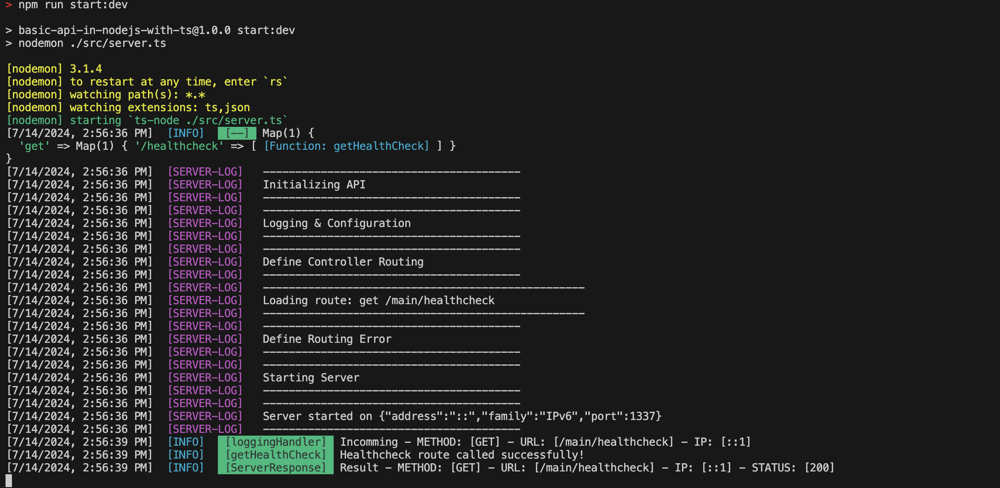

## api 만들기 전 초기 설정

> [code example](https://github.com/moonshine-archive/ts-express-playground/tree/main/api-in-depth)

### 라이브러리 설치

```zsh
npm init
npm install -D typescript ts-node nodemon
tsc --init
npm install express dotenv
npm install -D @types/express @types/node
```

package.json에서 main을 의미하는 entry point는 일반적으로 빌드 폴더 내부를 가리키는 게 일반적이지만, 라이브러리가 아니면 자유롭게 지정해주면 된다.<br>

작은 프로젝트에서 로깅은 불필요할 수 있지만, 이후 확장성에 도움이 된다.<br>
프로젝트 규모가 커지고 복잡해지면 [winston](https://github.com/winstonjs/winston) 같은 로깅 라이브러리를 사용하기도 하지만, 당장은 직접 구현하는 정도만 해도 충분하다.

- [config](https://github.com/moonshine-archive/ts-express-playground/blob/main/api-in-depth/src/config/config.ts)
- [logging](https://github.com/moonshine-archive/ts-express-playground/blob/main/api-in-depth/src/config/logging.ts)

### 서버 인스턴스 제어

`express()`는 일반적으로 router로 취급하지만 예제에서는 application으로 정의한다.<br>
`httpServer` 변수는 서버 종료/생성 역할을 하므로 `ReturnType<typeof http.createServer>` 타입으로 정의한다.<br>
로그는 logging으로만 사용한다.

http 라이브러리 요약

1. node.js 핵심 모듈 중 하나이다. http 서버와 클라이언트 생성 기능을 제공한다.
2. `http.createServer()` 메서드로 http 서버를 생성할 수 있다. (http 요청을 보내는 클라이언트 기능도 제공)
3. http 프로토콜을 직접 다룰 수 있는 저수준 api를 제공한다. (express도 내부적으로 http 모듈 기반으로 동작한다.)
4. node.js의 event driven architecture에 따라 비동기적으로 동작한다.

express가 내부적으로 http를 사용함에도 불구하고 별도로 사용하는 이유는 다음과 같다.

1. 서버 인스턴스 직접 제어 => `http.createServer(application)`를 사용해 http 서버 인스턴스를 직접 생성하고 관리한다. => 서버의 생명주기를 보다 세밀하게 제어할 수 있다. (예를 들어, 해당 예제에서는 `httpServer.close()`로 서버를 명시적으로 종료할 수 있는 코드도 작성해두었다.)
2. 서버 연결 관리, 타임아웃 설정 등 express에서 제공하지 않는 추가적인 이벤트나 메소드(혹은 웹소켓 등의 추가적인 프로토콜을 쉽게 통합 가능)를 사용하기 위해서이다.
3. 테스트 및 유연성 => 서버 인스턴스를 직접 제어함으로써 테스트 환경에서 서버를 쉽게 모킹하거나 수정할 수 있다.

참고로, `httpServer = http.createServer(application);`는 api가 express api라는 걸 알 수 있게 해주는 역할이기도 한다.

- [server.ts](https://github.com/moonshine-archive/ts-express-playground/blob/main/api-in-depth/src/server.ts)

### 미들웨어 생성

다양한 미들웨어를 위 server.ts에 import해서 개발 환경의 초기 설정을 구축한다.

#### loggingHandler

[loggingHandler.ts](https://github.com/moonshine-archive/ts-express-playground/blob/main/api-in-depth/src/middleware/loggingHandler.ts)

위 로깅 핸들러에서는 크게 3가지 로그를 추적한다. (METHOD, URL, IP)<br>
Response에서는 Status를 추가적으로 로그를 남긴다.

#### corsHandler

[corsHandler.ts](https://github.com/moonshine-archive/ts-express-playground/blob/main/api-in-depth/src/middleware/corsHandler.ts)

CORS는 웹 브라우저에서 보안상의 이유로 다른 출처(origin)의 리소스에 대한 접근을 제한하는 메커니즘이다.

예제이므로 일단 모든 출처를 허용한다. `res.header('Access-Control-Allow-Origin', req.header('origin'));`<br>
클라이언트가 사용할 수 있는 HTTP 헤더를 지정한다. `res.header('Access-Control-Allow-Headers', 'Origin, X-Requested-With, Content-Type, Accept, Authorization');`<br>
인증된 요청을 허용한다. `res.header('Access-Control-Allow-Credentials', 'true');`<br>

options 메서드로 오는 `preflight` 요청을 처리하기 위한 코드가 포함되어 있다.

#### routeNotFound

[routeNotFound.ts](https://github.com/moonshine-archive/ts-express-playground/blob/main/api-in-depth/src/middleware/routeNotFound.ts)

요청이 api를 통과했지만, 올바른 경로가 아닌 경우에 대한 처리를 담당하는 미들웨어다.

### Testing (supertest, jest)

[integration test](https://github.com/moonshine-archive/ts-express-playground/blob/main/api-in-depth/test/integration/application.test.ts)

supertest는 express.js 통합 테스트용 라이브러리다. (내부적으로 express 서버 구동시켜서 가상 요청 보내고 결과 검증)<br>통합 테스트는 단위 테스트의 전체 프로세스를 테스트하는 반면 jest는 메서드 레벨의 단위 테스트 목적의 라이브러리다.

## express의 route에 데코레이터 연결하기

타입스크립트의 데코레이터는 직관적으로 동작하지 않는다. (tsconfig.json에서 `"experimentalDecorators"` 조건을 true로 해두어야 한다.)<br>
`reflect-metadata`는 ts의 데코레이터를 사용하기 쉽게 만들어주는 라이브러리다. (nest.js도 해당 패키지를 기반으로 한다.)

`export type RouteHandler = Map<keyof Express, Map<string, RequestHandler[]>>;`에서 핸들러가 string[]인 이유는, 최종 함수 실행 전에 실행할 일부 미들웨어를 전달하는 옵션을 제공하기 위함이다. (당장은 아니더라도 미래를 대비해 배열로 만드는 게 좋다.)

- [src/library/routes.ts](https://github.com/moonshine-archive/ts-express-playground/blob/main/api-in-depth/src/library/routes.ts)

컨트롤러 데코레이터는 컨트롤러를 정의한다. (내부에서 메타데이터를 정의한 뒤, 이후 이 메타데이터 키를 호출하는 방식이다.)<br>
Route 데코레이터는 express route를 메소드 레벨에서 정의할 수 있게 해준다. (`Reflect.getMetadata`로 메타데이터를 가져오고, `Reflect.defineMetadata`으로 메타데이터를 업데이트한다.)

- [src/decorators/controller.ts](https://github.com/moonshine-archive/ts-express-playground/blob/main/api-in-depth/src/decorators/controller.ts)
- [src/decorators/route.ts](https://github.com/moonshine-archive/ts-express-playground/blob/main/api-in-depth/src/decorators/route.ts)

메타데이터로 정의한 것들을 로그로 찍기 위해 [defineRoutes](https://github.com/moonshine-archive/ts-express-playground/blob/main/api-in-depth/src/modules/routes.ts)를 정의하고 이를 서버 생성 시 주입해준다.



## Data Validation with Joi

견고하고 안전한 어플리케이션을 만들기 위해 Data Validation은 매우 중요한 측면이다. `joi`는 node.js에서의 데이터 검증을 쉽게 만드는 라이브러리다.

- [src/decorators/validate.ts](https://github.com/moonshine-archive/ts-express-playground/blob/main/api-in-depth/src/decorators/validate.ts)

```ts
import { Request, Response, NextFunction } from "express";
import Joi from "joi";

export function Validate(schema: Joi.ObjectSchema) {
  return function (
    target: any,
    propertyKey: string,
    descriptor: PropertyDescriptor
  ) {
    const originalMethod = descriptor.value;

    descriptor.value = async function (
      req: Request,
      res: Response,
      next: NextFunction
    ) {
      try {
        await schema.validateAsync(req.body);
      } catch (error) {
        logging.error(error);

        return res.status(422).json(error);
      }

      return originalMethod.call(this, req, res, next);
    };

    return descriptor;
  };
}
```

위 Validate 데코레이터에서는 request body에 대한 유효성 검사를 진행한다. 디스크립트를 교체하는 과정에서 유효성 검사를 진행한다.

## References

[Typescript API in NodeJS / Express in Depth [Part 1]](https://www.youtube.com/watch?v=NYZKUTGC51g&t=135s)<br>
[Typescript API Routing with Decorators! [Part 2]](https://www.youtube.com/watch?v=8Dv9yWAJ6ww)<br>
[Data validation with Typescript and Decorators [Part 3]](https://www.youtube.com/watch?v=dr8e6Nh1llk)<br>
