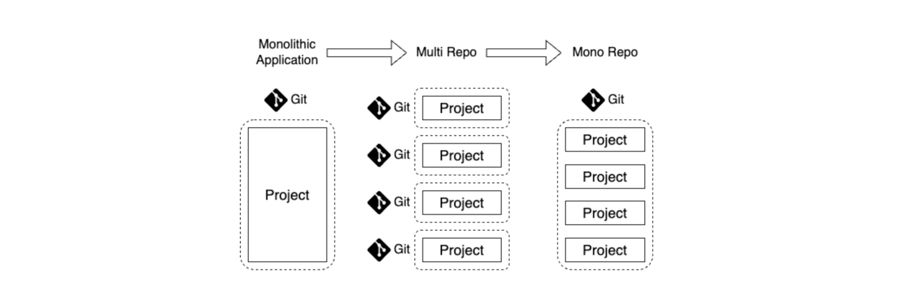

모노레포란 2개 이상의 프로젝트 코드를 동일한 저장소에서 관리하는 소프트웨어 개발 전략이다.



## 모노레포 기본 개념

### 모놀리식에서 멀티레포로

프로젝트 규모가 커질수록, 모놀리식 어플리케이션(Monolithic Application)의 한계가 명확해진다.<br>
코드들이 모듈화없이 단 하나의 버전으로 관리되므로, 관심사 분리, 설계, 리팩토링, 배포 등의 작업이 매번 비대해진다.

모놀리식의 한계를 해결하기 위해 어플리케이션을 모듈화(Modularity)할 수 있다.<br>
모듈화한 어플리케이션들을 다른 어플리케이션에 쉽게 적용하기 위해 독자적인 저장소로 분리해 관리할 수 있다.<br>
이러한 구조를 멀티레포(Multirepo, 혹은 Polyrepo)라고 한다.<br>

### 멀티레포의 단점

매번 프로젝트를 만들 때마다 초기 설정을 일일이 해야 한다. 일반적으로 프로젝트 초기 설정은 중복이 많을 수밖에 없다. (중복 코드 발생)<br>
모듈화된 저장소가 늘어날 수록 관리 포인트도 비례해서 증가한다. 게다가 서로 의존되어 있다면 하나의 저장소를 변경할 때 다른 곳의 패키지도 계속해서 번거로운 배포 과정을 거쳐야 한다.<br>
모듈 저장소들은 별도의 저장소로 존재하기 때문에 일관된 컨벤션을 지키기 어렵다. 자율성과 독립성이 높기에.

### 모노레포의 장점

[모던 프론트엔드 프로젝트 구성 기법 - 모노레포 개념 편](https://d2.naver.com/helloworld/0923884)에서는 모노레포의 장점으로 다음 요소들을 꼽는다.

#### 관리측면

- 코드 공유: 서로 다른 프로젝트 간에 쉽게 소스 코드를 공유
- 일관성 있는 도구: 서로 다른 프로젝트들(심지어 서로 다른 프레임워크를 사용하더라도)에서 일관된 개발 경험을 제공
- 스케폴딩: 새로운 프로젝트를 생성할 때 초기 코드를 쉽게 생성
- 프로젝트 제약 및 가시성(visibility): 저장소 내에서 의존 관계를 제한하는 규칙 정의 지원. 예를 들어, 일부 프로젝트를 팀 전용으로 표시하거나 특정 프레임워크을 사용 중임을 기술.

#### 속도 측면

- 로컬 캐싱: 같은 머신에서 같은 것을 두 번 빌드하거나 테스트하지 않음
- 분산 캐싱: 다양한 환경에서 캐시 아티팩트를 공유. 즉, 조직 단위로 여러 CI 환경에 걸쳐 같은 것을 두 번 빌드, 테스트하지 않음
- 로컬 작업 오케스트레이션: 빌드 및 테스트 등의 작업을 순서에 맞게 병렬로 실행
- 분산 작업 실행: 단일 시스템에서 실행되어 여러 시스템에 명령을 전달
- 변화에 영향을 받는 프로젝트 감지: 변경의 영향을 받을 수 있는 항목을 결정하여 영향을 받는 프로젝트만 빌드/테스트

#### 구조 파악 측면

- 워크스페이스 분석: 추가 구성 없이 주어진 워크 스페이스의 의존성 관계를 분석
- 의존성 그래프 시각화: 프로젝트 및 작업 간의 종속 관계를 시각화

### 모노레포의 단점

규모가 크지 않은 상황에서 모노레포의 전환은 오버헤드일 뿐이다.

## 모노레포 직접 구축해보기

[Code Example](https://github.com/moonshine-archive/fe-playground/tree/main/mono-in-pnpm-workspace)<br>
([컨벤션 문서](https://github.com/moonshine-archive/fe-playground/blob/main/mono-in-pnpm-workspace/README_CONVENTIONS.md) 참고)

폴더 구조는 Nx의 라이브러리 타입을 참고했다. (크게 4가지 라이브러리 타입(`feature, data-access, ui, util`)과 `shared` 타입으로 프론트엔드의 아키텍쳐를 구축해나가는 접근법이다.)

기술 스택은 다음과 같다.

- 각 패키지에 대한 개발 환경과 빌드 도구로는 `vite`, `tsup`을 사용했다.
- 스타일은 디자인 시스템은 `shadcn/ui`를 기반으로 하고, 메인 프로젝트에서는 `emotion`을 사용했다.
- 모노레포 전체 코드 품질과 일관성을 위해서는 `eslint`, `husky`, `commitlint`를 사용했다.
- 템플릿으로는 아주 기본적으로 `PR`과 `ISSUE`만 사용했다.

pnpm workspace는 공식 문서에 잘 설명되어 있지만, 아래와 같은 부분을 이해하면 특히 좋다.

pnpm의 경우,<br>
`pnpm-workspace.yaml` 파일에 워크스페이스로 사용할 디렉토리를 작성하면 된다.<br>
package.json의 workspaces 안에 작성해두면 패키지를 가져올 때 `workspace:*`를 사용할 수 있다.

```json
// package.json
...

"devDependencies": {
    "@commitlint/cli": "^18.6.1",
    "@commitlint/config-conventional": "^18.6.2",
    "@ttflow/eslint-config-custom": "workspace:*",
    "@ttflow/tsconfig": "workspace:*",
    "@types/node": "^20.11.16",
    "husky": "^9.0.10",
    "pnpm": "^8.15.1",
    "typescript": "^5.2.2"
  },
```

`workspace:*`라고 명시하지 않고 직접적인 버전을 명시해도 된다. `workspace:^1.0.0`

패키지를 배포하지 않아도, 위와 같이 package.json의 name으로 패키지를 가져올 수 있다.<br>
예를 들어, @ttflow/tsconfig는 아래와 같이 작성되어 있다.

```json
// packages/tsconfig/package.json
{
  "name": "@ttflow/tsconfig",
  "version": "1.0.0",
  "main": ".",
  "private": true
}
```
